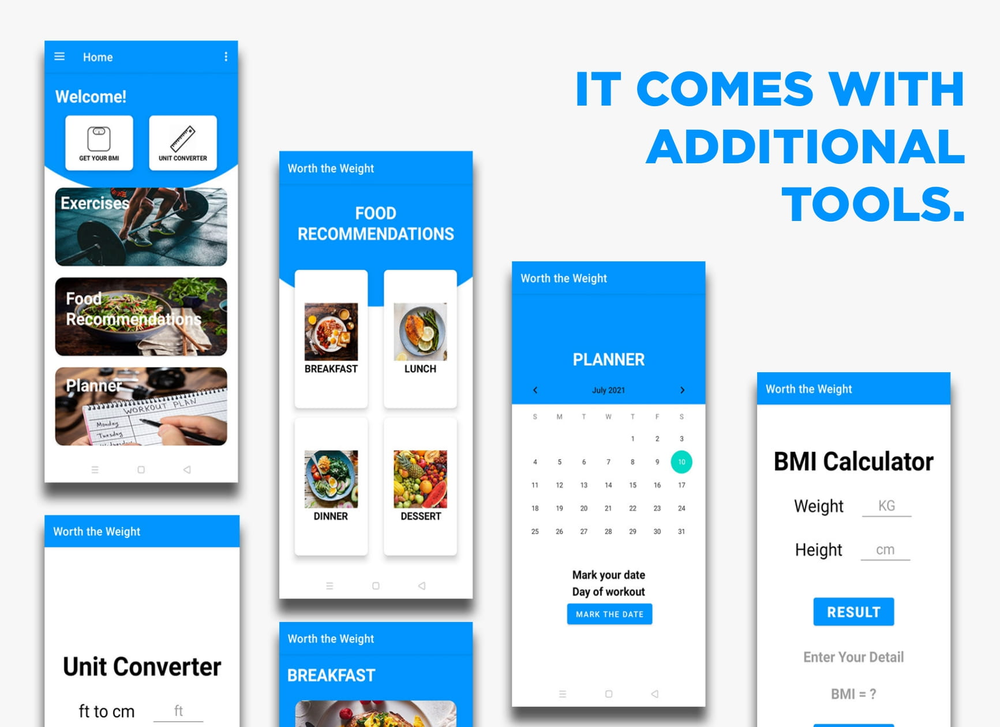

# Worth The Weight Fitness Application 

This application provides routines/exercises that enhances or maintain physical health and fitness. It also provides some food recommendations with recipe that is good for you according to your goal. It is also containing BMI calculator and unit converter that will help the users to determine what is the best exercise/routine for them.

## Features
- BMI Calculator.
- Unit converter.
- Healthy food recommendation with recipes
- Planner
- Workout routine guides and description.

## Contributers
- Llemit, Jonathan Jr.
- Aynera, Kj
- Ciabal, Reynel
- Espere, Edward
- Lagadon, Tiffany
- Merantes, John Vincent
- Reyes, Brandell

## Screen Shots

